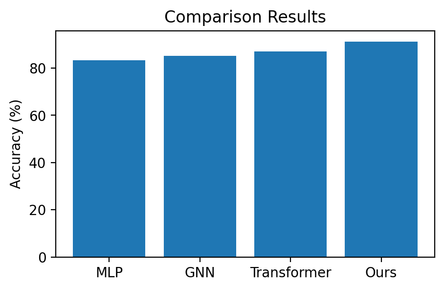
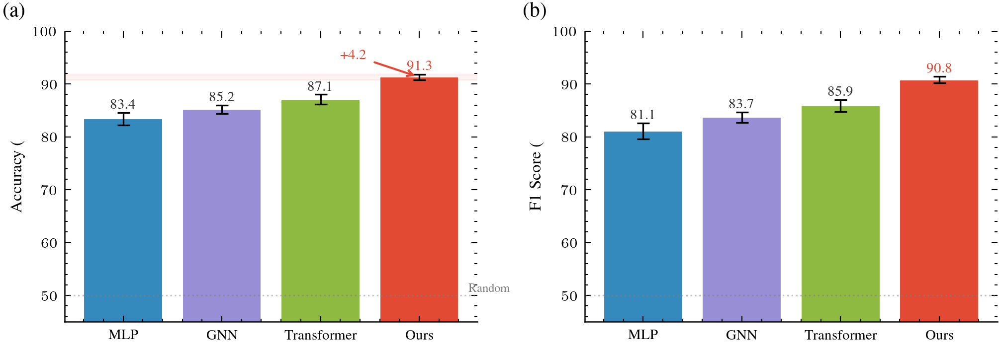
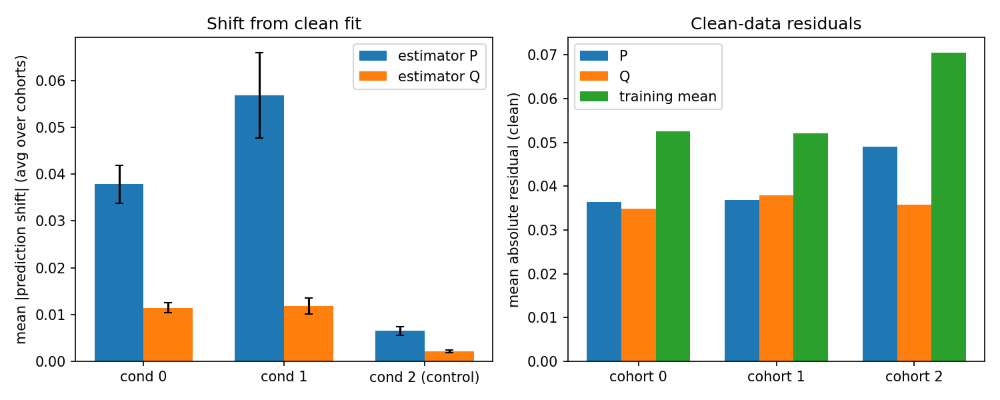
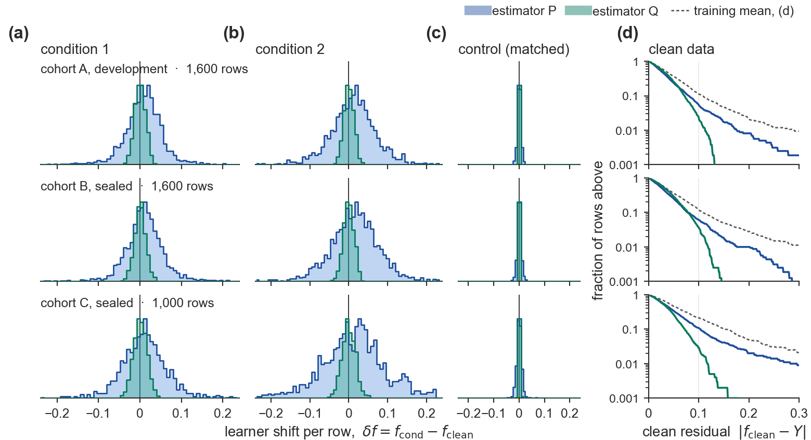
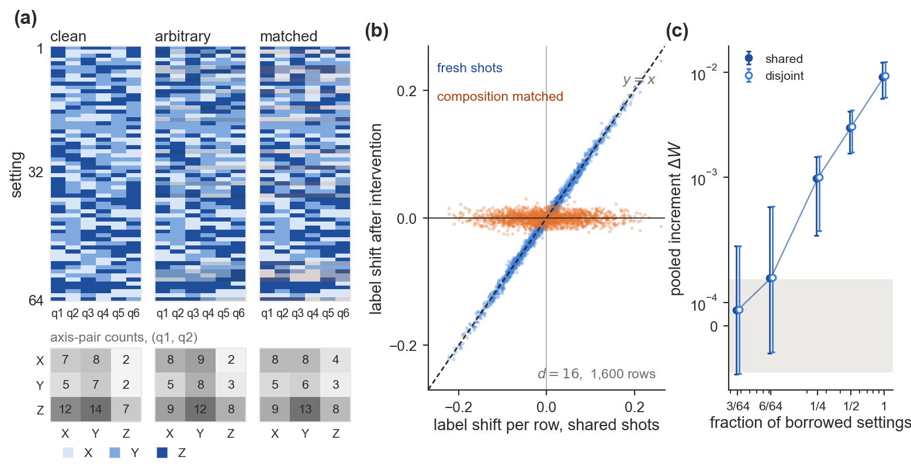

# Academic Figure Patterns

**Design patterns for publication-quality academic figures — focused on *content*, not just aesthetics.**

[](https://opensource.org/licenses/MIT)
[](https://www.python.org/downloads/)

---

## The Problem

Most plotting tutorials teach you *how to use matplotlib*. This project teaches you **what to put in your figures** to make them publication-ready for top venues (NeurIPS, ICML, ICLR, Nature, etc.).

The difference between an undergraduate thesis figure and a top-venue figure is **not** fonts or colors — it's **content design**: what data to show, how to organize comparisons, what annotations guide the reader's eye, and how the figure tells a story without words.

### Before vs After

| Before (undergraduate level) | After (publication ready) |
|:---:|:---:|
|  |  |
| 4 bare bars. No error bars, no reference line, no annotations, no story. | Dual-panel, error bars, reference line, sorted by performance, gap annotation, shaded confidence region, color-coded by method. |

## What This Is (and Isn't)

| Tool | What it does | Complements AFP? |
|------|-------------|:---:|
| [SciencePlots](https://github.com/garrettj403/SciencePlots) | Fonts, line widths, aesthetic style | ✅ AFP integrates it |
| [tueplots](https://github.com/pnkraemer/tueplots) | Figure sizes for specific venues | ✅ AFP integrates it |
| **Academic Figure Patterns** | **What to put IN the figure** | — |

AFP answers questions like:
- *"I have comparison results. How do I make the figure convincing?"*
- *"What elements do NeurIPS papers include in ablation figures?"*
- *"How do I make readers see our advantage in 2 seconds?"*

## Quick Start

### Install

```bash
pip install academic-figure-patterns          # core only
pip install academic-figure-patterns[full]    # with SciencePlots + tueplots
```

### Use in your code

```python
from afp import setup_style, get_method_colors, save_fig

# One line to set up venue-specific style (integrates SciencePlots + tueplots)
TEXTWIDTH, COLWIDTH = setup_style(venue='icml')

# Your method always gets the prominent color
colors = get_method_colors(['GNN', 'Transformer', 'Ours'])
# → {'GNN': '#348ABD', 'Transformer': '#988ED5', 'Ours': '#E24A33'}
```

### Read the patterns

The real value is in the pattern library. Start here:

1. **[Spec First](docs/SPEC_FIRST.md)** — write the four-question spec per panel *before* plotting (new in 0.2)
2. **[Form Ladder](docs/FORM_LADDER.md)** — what reviewers mean by "cheap", and the five-level ladder from summary panels to per-sample evidence (new in 0.2)
3. **[Claim → Pattern Map](docs/CLAIM_TO_PATTERN.md)** — "I want to show X" → read pattern Y
4. **[Anti-Patterns](docs/ANTI_PATTERNS.md)** — 21 common mistakes that scream "amateur"
5. **[Storytelling Techniques](docs/STORYTELLING.md)** — 10 visual narrative techniques from top papers

## New in 0.2: Field-Tested Rules From Author Review

The 0.1 release was distilled from published papers. Since then the patterns were used on two real
manuscripts through ~30 rejected figure versions and validated by three blind runs. Three things changed:

| Old advice | What review taught |
|---|---|
| "Add elements until the panel has ≥ 6" | Six annotations on three bars is still three bars. The fix is **per-sample data whose structure is the conclusion**; pooled statistics go last and smallest. |
| Pick a pattern, then plot | **Write the spec first** (claim, comparison, encoding, *what it looks like if the claim is false*) and get it approved before any code. Every figure that skipped this was rejected at least twice. |
| Caption = conclusion | True at ML venues. **APS journals want the caption to describe and the text to conclude.** See [Venue Rules](docs/VENUE_RULES.md). |

Read the verbatim rejected → accepted record in [Case Studies: Author Review](docs/CASE_STUDIES_AUTHOR_REVIEW.md),
and the new [Pattern 11: Per-Sample Evidence](patterns/11_per_sample_evidence.md) with code in `afp/evidence.py`.
Four runnable examples on synthetic data reproduce the accepted forms: [examples/README_pattern11.md](examples/README_pattern11.md).

| Before (drawn by a context-free agent from the same data) | After (rules applied, same data) |
|:---:|:---:|
|  |  |
| Grouped bars of means with error bars. | Per-sample shift distributions per cohort × condition, wide vs narrow estimator, control column compressed, exceedance column for the tail claim. |

Nine such pairs, one per form and venue: [examples/README_pattern11.md](examples/README_pattern11.md).



## Core Concept: Claim-First Design

Every figure starts with a **claim** — the one-sentence conclusion the reader should draw.

| ❌ Bad claim | ✅ Good claim |
|---|---|
| "Training curves" | "Our method converges 3× faster than baselines" |
| "Comparison results" | "Our method outperforms all baselines by 4.2% average" |
| "Ablation study" | "Attention contributes 47% of improvement; removing it causes failure" |

The claim determines which **pattern** to use, which determines the figure's structure.

## The Pattern Library

### 11 Design Patterns

Each pattern documents the visual structure, required elements, and code template for a common figure type:

| # | Pattern | When to use | Min. elements |
|---|---------|------------|:---:|
| 01 | [Hero Figure](patterns/01_hero_figure.md) | Paper's "elevator pitch" (Fig 1) | 8 |
| 02 | [Main Comparison](patterns/02_main_comparison.md) | "We beat baselines" | 8 |
| 03 | [Ablation Study](patterns/03_ablation.md) | "Each component matters" | 7 |
| 04 | [Scaling Analysis](patterns/04_scaling.md) | "We scale better" | 7 |
| 05 | [Training Dynamics](patterns/05_training_dynamics.md) | "We converge faster" | 7 |
| 06 | [Qualitative Results](patterns/06_qualitative.md) | Visual output comparison | 6 |
| 07 | [Analysis & Insight](patterns/07_analysis.md) | "Here's why it works" | 6 |
| 08 | [Pareto Tradeoff](patterns/08_pareto_tradeoff.md) | Efficiency vs performance | 7 |
| 09 | [Distribution Analysis](patterns/09_distribution.md) | Statistical robustness | 6 |
| 10 | [Quantum Hardware](patterns/10_quantum_hardware.md) | Quantum device results | 7 |
| 11 | [Per-Sample Evidence](patterns/11_per_sample_evidence.md) | "The effect is in the data, row by row" — paired clouds, distribution grids, exceedance curves | 6 |

### 14 Visualization Techniques

Advanced techniques with complete code:

| # | Technique | Replaces |
|---|-----------|---------|
| 01 | [Inset Zoom](techniques/01_inset_zoom.md) | Squinting at convergence regions |
| 02 | [Broken Axis](techniques/02_broken_axis.md) | Misleading y-axis truncation |
| 03 | [Annotations](techniques/03_annotations.md) | Bare plots with no story |
| 04 | [Complex Layouts](techniques/04_complex_layouts.md) | Single-panel syndrome |
| 05 | [Waterfall Chart](techniques/05_waterfall.md) | Plain bars for ablation |
| 06 | [Radar Chart](techniques/06_radar.md) | Multiple separate bar charts |
| 07 | [Bump Chart](techniques/07_bump_chart.md) | Ranking tables |
| 08 | [Sankey Diagram](techniques/08_sankey.md) | Complex flow descriptions |
| 09 | [Ridge Plot](techniques/09_ridge_plot.md) | Overlapping histograms |
| 10 | [Dumbbell Chart](techniques/10_dumbbell.md) | Grouped bars for before/after |
| 11 | [Joint + Marginal](techniques/11_joint_marginal.md) | Scatter without context |
| 12 | [Connection Patch](techniques/12_connection_patch.md) | Disconnected subplots |
| 13 | [Advanced Chart Types](techniques/13_advanced_chart_types.md) | Default matplotlib only |
| 14 | [Storytelling](docs/STORYTELLING.md) | Figures without narrative |

### 10 Storytelling Techniques

Narrative strategies extracted from NeurIPS/ICML best papers:

| # | Technique | Example Paper |
|---|-----------|--------------|
| S1 | Set up, then debunk | Emergent Abilities (NeurIPS'23 Best) |
| S2 | Dual panel: eliminate alternatives | ResNet, Mamba |
| S3 | Validate → Extrapolate | IBM Quantum Utility (Nature'23) |
| S4 | Causal branching | Emergent Abilities Fig 2 |
| S5 | Progressive information density | ViT Fig 1→5→7 |
| S6 | Reference band (not point) | ViT Fig 3 (BiT band) |
| S7 | Axis choice = argument | Emergent Abilities Fig 4 (log reveals "zero isn't zero") |
| S8 | Sorting = narrative | GPT-4 exam scores |
| S9 | Caption = conclusion | All NeurIPS Best Papers |
| S10 | One figure, one claim | DPO |

## The "2-Second Test"

A good figure passes this test: **cover all text, look at only shapes and colors for 2 seconds.** Can you tell who wins? If not, the figure fails.

Visual storytelling tools (use ≥3 per figure):
- **Color contrast**: Your method = prominent red/orange; baselines = muted blues/grays
- **Sorting**: Arrange from worst to best; your method appears rightmost
- **Shaded band**: Show baseline performance range as gray band; your point clearly above
- **Gap arrow**: One clean arrow + number at the most critical comparison
- **Pareto frontier**: Your dots on the frontier; dominated region grayed out

## 21 Anti-Patterns

Things that instantly mark your figure as amateur:

| # | Anti-Pattern | Fix |
|---|-------------|-----|
| AP-01 | Bare minimum (just 3 bars) | Add error bars + reference line + annotation (≥6 elements) |
| AP-02 | No context (only your method) | Add ≥3 baselines + ≥2 datasets |
| AP-03 | Only plt.bar/plot/scatter | Use waterfall, violin, Pareto, ridge, etc. |
| AP-04 | Silent figure (no story) | One claim per figure + annotate key finding |
| AP-11 | Wrong scale (linear for 3 orders) | Log-log for power laws; semi-log for exponentials |
| AP-12 | Single panel syndrome | Add test panel, different dataset, or different metric |
| AP-13 | No reference lines | Add random chance / human / SOTA / theoretical bound |
| AP-14 | Caption describes, not concludes | First sentence = takeaway, not "Figure X shows..." |

See [full anti-pattern list](docs/ANTI_PATTERNS.md) for all 21 with examples; AP-15 to AP-21 come from author review of real manuscripts.

## Real Paper Case Studies

[25+ figures from 18 top-venue papers](docs/REAL_PAPER_CASES.md) analyzed in detail:

- **Scaling Laws** (Kaplan et al.) — Rainbow training curves on log-log
- **Chinchilla** — IsoFLOP curves + contour plots
- **FlashAttention** — Runtime crossover annotations
- **ViT** — Shaded baseline band, Pareto frontier, multi-type visualization
- **ResNet** — 7-figure argumentative arc
- **GPT-4** — Exam percentile bar chart
- **DDPM** — Progressive generation visualization
- **Emergent Abilities** (NeurIPS'23 Best) — "Set up then debunk" with metric change
- **DPO** — Reward-KL frontier
- **Mamba** — 4-order-of-magnitude extrapolation
- **Google Sycamore/QEC** (Nature) — Topology heatmaps, ECDF, 3D syndrome
- **IBM Utility** (Nature'23) — Validate-then-extrapolate with light cone insets

## Python API

```python
from afp import (
    # Style
    setup_style,          # Configure matplotlib (SciencePlots + tueplots)
    get_figsize,          # Venue-aware figure dimensions
    get_method_colors,    # Semantic color assignment

    # Annotations (use sparingly — max 2-3 per figure)
    add_panel_labels,     # Auto (a), (b), (c)
    add_reference_line,   # Horizontal reference (random, human, SOTA)
    add_vref_line,        # Vertical reference (crossover, threshold)
    annotate_best,        # Arrow pointing to best result
    annotate_gap,         # Double arrow showing gap between methods
    significance_bracket, # Statistical bracket with stars

    # Visual storytelling
    add_shaded_region,    # Highlight performance band
    add_inset_zoom,       # Magnify convergence region
    sorted_bar_data,      # Sort by value (sorting = narrative)
)
```

## Supported Venues

| Venue | Textwidth | tueplots bundle |
|-------|-----------|:---:|
| NeurIPS | 5.50" | ✅ |
| ICML | 6.75" | ✅ |
| ICLR | 5.50" | ✅ |
| CVPR | 6.875" | ✅ |
| AAAI | 7.00" | ✅ |
| Nature | 7.09" | — |
| PRL/PRA | 3.375" | — |
| QST/Quantum | 3.375"/5.50" | — |

## Contributing

We welcome contributions! See [CONTRIBUTING.md](CONTRIBUTING.md) for guidelines.

Ways to contribute:
- Add a new design pattern for a figure type we missed
- Add a new technique with code
- Add real paper case studies
- Translate documentation
- Report anti-patterns you've encountered

## Citation

If you find this useful in your research, please consider citing:

```bibtex
@software{afp2026,
  title = {Academic Figure Patterns: Design Patterns for Publication-Quality Figures},
  author = {Li, Jintao},
  year = {2026},
  url = {https://github.com/taoge946/academic-figure-patterns},
}
```

## License

MIT License. See [LICENSE](LICENSE).
