# Academic Figure Patterns

**Design patterns for publication-quality academic figures — focused on *content*, not just aesthetics.**

**English** | [中文](README_zh.md)

[](https://opensource.org/licenses/MIT)
[](https://www.python.org/downloads/)

---

## The Problem

Most plotting tutorials teach you *how to use matplotlib*. This project helps you decide **what evidence to put
in a figure, and why** — for top venues (NeurIPS, ICML, ICLR, Nature, APS journals, etc.).

The difference between an undergraduate thesis figure and a top-venue figure is **not** fonts or colors — it's **content design**: what data to show, how to organize comparisons, what annotations guide the reader's eye, and how the figure tells a story without words.

**The method in one minute.** Before writing any plotting code, answer four questions per panel
([Spec First](docs/SPEC_FIRST.md)):

1. **Claim** — what should the reader conclude with the caption covered?
2. **Comparison** — what is compared against what? No comparison, no panel.
3. **Encoding** — which visual form makes that comparison readable at a glance?
4. **Counterfactual** — what would the panel look like if the claim were false? If you can't say, the panel
   isn't testing anything.

Then pick the form from the [pattern library](#the-pattern-library), and keep it honest
([which rules are requirements](docs/RULE_STRENGTH.md)).

## Before → After: the same data, drawn twice

Every pair below comes from **one `.npz` file** (`examples/data/`). The left column is the five-minute look at
the data: one panel, one basic chart type, matplotlib defaults. The right column applies the rules in this
repository. The data are synthetic and the labels generic, so what you see is the *form*, not a result.
Scripts for both columns are in `examples/` (`before_<id>.py` and `<id>_*.py`); details in
[examples/README_pattern11.md](examples/README_pattern11.md).

### Physics-style result figures (per-sample evidence)

| Before | After |
|:---:|:---:|
| 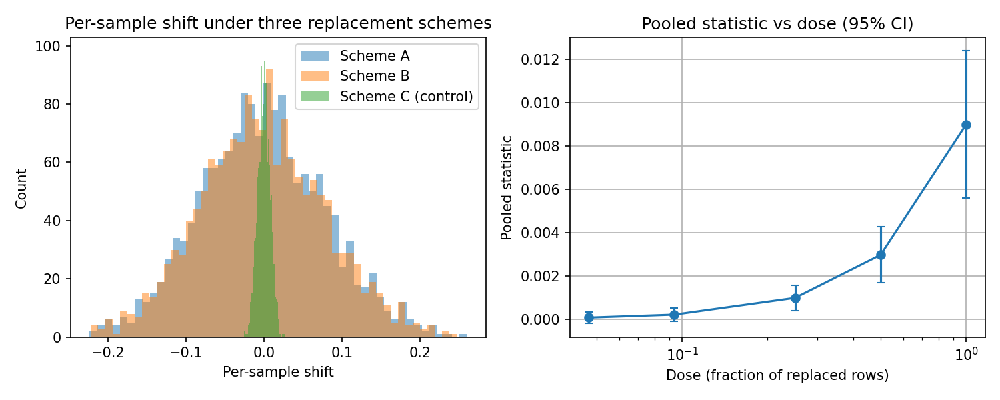 |  |
| Three bars of means. | **Object → paired cloud → endpoint.** The record itself as a matrix (reference and two replacement schemes with their pair counts); every sample as a point, scheme B on the identity line, the control scheme on the zero line; the pooled dose curve last and smallest. |
|  |  |
| Grouped bars of means, P vs Q. | **Distribution grid + tail column.** Cohorts × conditions, two peak-normalized per-sample distributions per cell (one wide, one narrow; both collapse in the control column); exceedance curves of the residual show which estimator makes fewer large errors. |
| 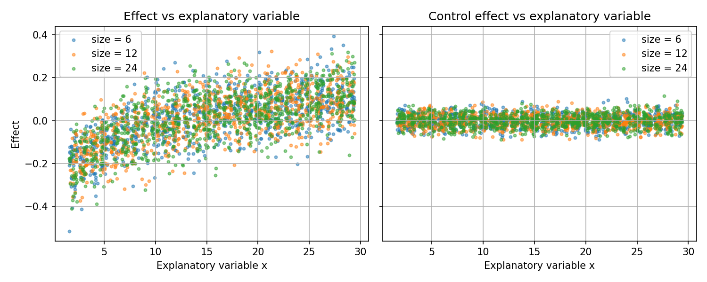 | 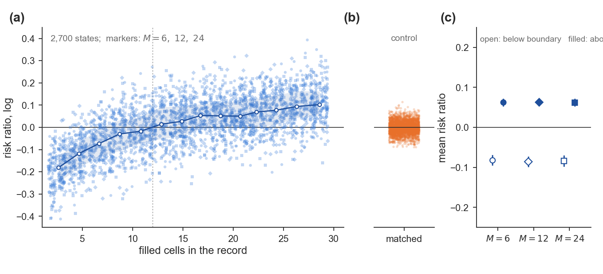 |
| One default scatter. | **Mechanism cloud.** Effect against a nameable explanatory variable, three system sizes on one curve, binned medians with an IQR band marking the zero crossing; the control compressed to a strip; the endpoint last. |
| 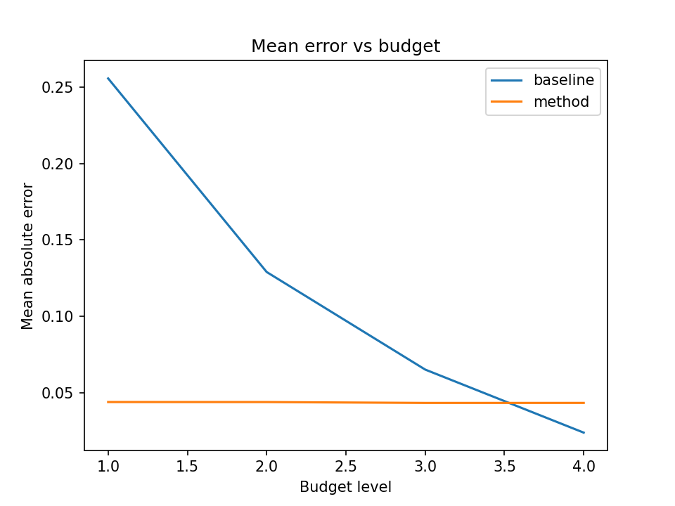 | 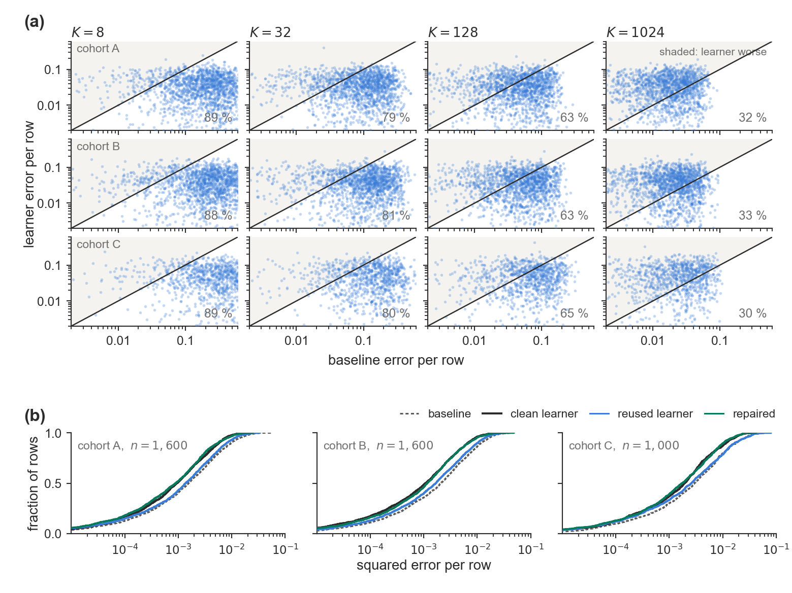 |
| Two lines of mean error. | **Error-vs-error grid.** Cohorts × budgets, each point one sample, method error against baseline error; the whole argument is the clouds drifting across the diagonal as the budget grows; ECDFs below. |
| 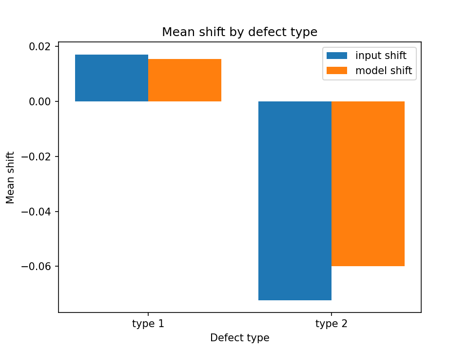 | 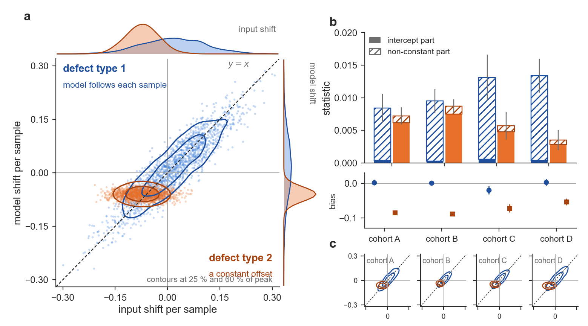 |
| Two grouped bars of means. | **Joint cloud with contours and marginals.** Two defect types on the same samples: one follows the diagonal, one is a constant offset; density contours, marginals, then the decomposition per cohort with the bias below, and contour small multiples. |
| 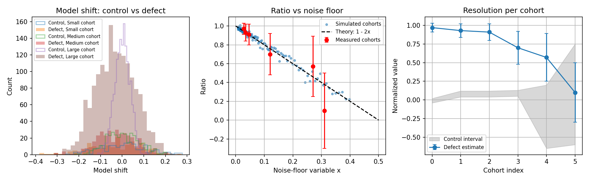 | 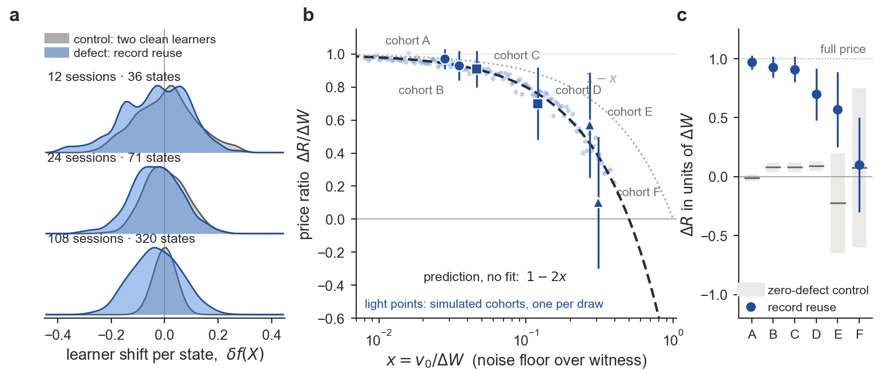 |
| Grouped bars by cohort size. | **Ridges + parameter-free prediction + resolution.** Control vs defect distributions per cohort size; the ratio against the noise floor with simulated cohorts as light points and two prediction lines drawn without fitting; a resolution panel of control band vs defect bar. |
| 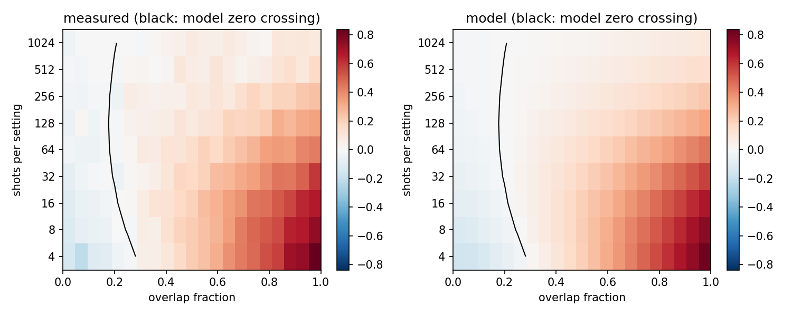 | 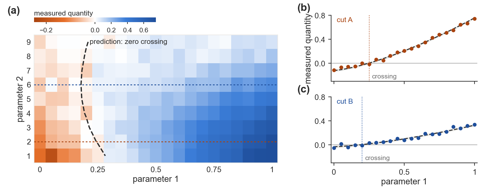 |
| Nine overlaid lines. | **Measured parameter heat map + prediction contour.** The measured quantity on its 2-D grid, the theory's zero crossing as one contour on top, and two line cuts where the crossing can be read. |

### ML and systems venues (same rules, different look)

| Before | After |
|:---:|:---:|
| 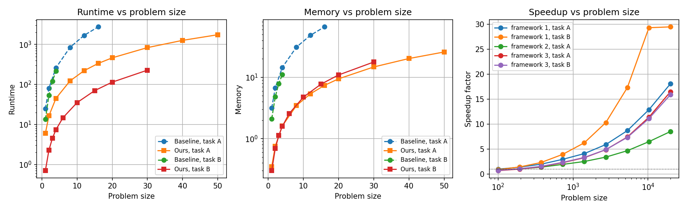 | 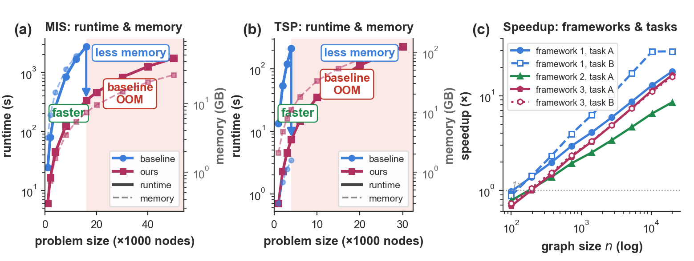 |
| Two runtime lines on linear axes. | **Hero scaling figure.** Runtime and memory against size on twin log axes, the baseline's failure region shaded, gap arrows; speedup against size with a 1× line. |
| 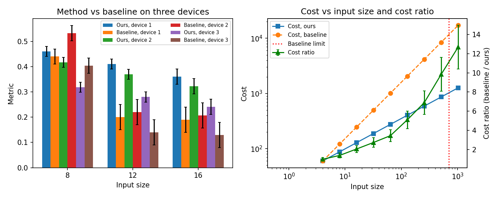 | 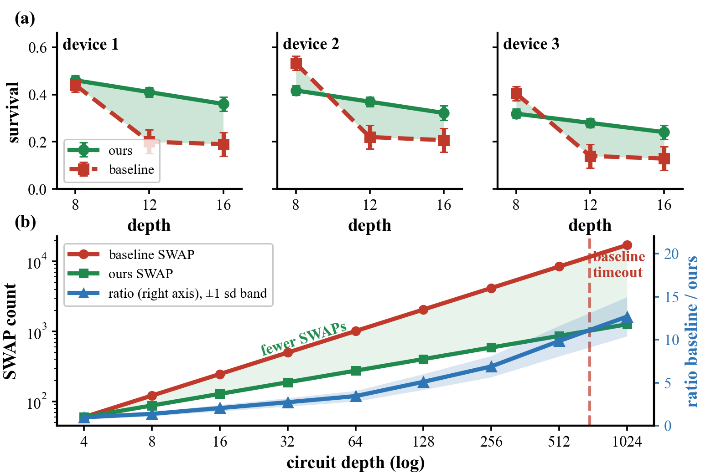 |
| Grouped bars of a mean metric. | **Systems sweep.** Per-device metric with the gap filled; cost against input size with the ratio and its band on a twin axis and the baseline's limit as a wall. Heavy lines and large type for a column that will be shrunk. |

The earlier ML-style pairs from 0.1 (`examples/figures/01–03_*.png`) are still in `examples/`; in 0.2.1 they were
redrawn so they follow the repository's own integrity rules (dot plots instead of truncated bars, no invented
"crossover", log-scale speedups).

> **Read the before column as a teaching contrast, not a benchmark.** The "before" figures are deliberately
> minimal. They show what the rules add; they do not show that the "after" forms beat a careful simple
> figure, which is sometimes the better choice.

## What This Is (and Isn't)

| Tool | What it does | Complements AFP? |
|------|-------------|:---:|
| [SciencePlots](https://github.com/garrettj403/SciencePlots) | Fonts, line widths, aesthetic style | ✅ AFP integrates it |
| [tueplots](https://github.com/pnkraemer/tueplots) | Figure sizes for specific venues | ✅ AFP integrates it |
| **Academic Figure Patterns** | **What to put IN the figure** | — |

AFP answers questions like:
- *"I have comparison results. What should the main panel actually compare?"*
- *"What would this figure look like if our claim were false — and can the reader tell?"*
- *"Should this be a per-sample figure, a simple dot plot, or a table?"*

## Quick Start

### Install

Not on PyPI yet; install from GitHub:

```bash
pip install "academic-figure-patterns @ git+https://github.com/taoge946/academic-figure-patterns"
# with SciencePlots + tueplots:
pip install "academic-figure-patterns[full] @ git+https://github.com/taoge946/academic-figure-patterns"

# or, to run the examples and tests:
git clone https://github.com/taoge946/academic-figure-patterns.git
cd academic-figure-patterns && pip install -e ".[dev]"
```

LaTeX is optional: `setup_style()` uses it only when it is installed (`usetex=True/False` to force).

### Use in your code

```python
from afp import setup_style, get_method_colors, save_fig

# One line to set up venue-specific style (integrates SciencePlots + tueplots; LaTeX optional)
TEXTWIDTH, COLWIDTH = setup_style(venue='icml')

# Your method always gets the prominent color
colors = get_method_colors(['GNN', 'Transformer', 'Ours'])
# → {'GNN': '#348ABD', 'Transformer': '#988ED5', 'Ours': '#E24A33'}
```

### Read the patterns

The real value is in the pattern library. Start here:

0. **[How Strong Is Each Rule?](docs/RULE_STRENGTH.md)** — integrity requirements vs design defaults vs one reviewer's preferences (new in 0.2.1)
1. **[Spec First](docs/SPEC_FIRST.md)** — write the four-question spec per panel *before* plotting (new in 0.2)
2. **[Form Ladder](docs/FORM_LADDER.md)** — what reviewers mean by "cheap", and the five-level ladder from summary panels to per-sample evidence (new in 0.2)
3. **[Claim → Pattern Map](docs/CLAIM_TO_PATTERN.md)** — "I want to show X" → read pattern Y
4. **[Anti-Patterns](docs/ANTI_PATTERNS.md)** — 21 common mistakes that scream "amateur"
5. **[Storytelling Techniques](docs/STORYTELLING.md)** — 10 visual narrative techniques from top papers

## New in 0.2: Field-Tested Rules From Author Review

The 0.1 release was distilled from published papers. Since then the patterns were used on two real
manuscripts through ~30 rejected figure versions and validated by three blind runs. Three things changed:

| Old advice | What review taught |
|---|---|
| "Add elements until the panel has ≥ 6" | Six annotations on three bars is still three bars. The fix is **per-sample data whose structure is the conclusion**; pooled statistics go last and smallest. |
| Pick a pattern, then plot | **Write the spec first** (claim, comparison, encoding, *what it looks like if the claim is false*) and get it approved before any code. Every figure that skipped this was rejected at least twice. |
| Caption = conclusion | True at ML venues. **APS journals want the caption to describe and the text to conclude.** See [Venue Rules](docs/VENUE_RULES.md). |

Read the verbatim rejected → accepted record in [Case Studies: Author Review](docs/CASE_STUDIES_AUTHOR_REVIEW.md),
and the new [Pattern 11: Per-Sample Evidence](patterns/11_per_sample_evidence.md) with code in `afp/evidence.py`.
Nine runnable before/after pairs on synthetic data reproduce the accepted forms (gallery at the top of this
README; scripts and notes in [examples/README_pattern11.md](examples/README_pattern11.md)).

## Core Concept: Claim-First Design

Every figure starts with a **claim** — the one-sentence conclusion the reader should draw.

| ❌ Bad claim | ✅ Good claim | If the claim were false, the figure would show… |
|---|---|---|
| "Training curves" | "Our method converges 3× faster than baselines" | curves reaching the target loss at the same step |
| "Comparison results" | "Our method outperforms all baselines by 4.2% average" | a difference interval that crosses zero |
| "Ablation study" | "Attention contributes 47% of improvement; removing it causes failure" | a small attention step, and no drop when it is removed |

The claim determines which **pattern** to use, which determines the figure's structure. A good claim is
*testable*: the third column must be something the figure could actually show. Decide the claim from the
results; the figure's job is to let the reader check it, not to make it look bigger.

## The Pattern Library

### 11 Design Patterns

Each pattern documents the visual structure, the elements the comparison needs, and a code template for a
common figure type. The elements are there for a reason each; they are not a count to reach.

| # | Pattern | When to use |
|---|---------|------------|
| 01 | [Hero Figure](patterns/01_hero_figure.md) | Paper's "elevator pitch" (Fig 1) |
| 02 | [Main Comparison](patterns/02_main_comparison.md) | "We beat baselines" — dot plot or difference plot; bars only from zero |
| 03 | [Ablation Study](patterns/03_ablation.md) | "Each component matters" |
| 04 | [Scaling Analysis](patterns/04_scaling.md) | "We scale better" |
| 05 | [Training Dynamics](patterns/05_training_dynamics.md) | "We converge faster" |
| 06 | [Qualitative Results](patterns/06_qualitative.md) | Visual output comparison |
| 07 | [Analysis & Insight](patterns/07_analysis.md) | "Here's why it works" |
| 08 | [Pareto Tradeoff](patterns/08_pareto_tradeoff.md) | Efficiency vs performance |
| 09 | [Distribution Analysis](patterns/09_distribution.md) | Statistical robustness |
| 10 | [Quantum Hardware](patterns/10_quantum_hardware.md) | Quantum device results |
| 11 | [Per-Sample Evidence](patterns/11_per_sample_evidence.md) | "The effect is in the data, row by row" — paired clouds, distribution grids, exceedance curves |

### 14 Visualization Techniques

Advanced techniques with complete code:

| # | Technique | Replaces |
|---|-----------|---------|
| 01 | [Inset Zoom](techniques/01_inset_zoom.md) | Squinting at convergence regions |
| 02 | [Broken Axis](techniques/02_broken_axis.md) | One outlier squashing the rest (not narrow-range bars) |
| 03 | [Annotations](techniques/03_annotations.md) | Bare plots with no story |
| 04 | [Complex Layouts](techniques/04_complex_layouts.md) | Single-panel syndrome |
| 05 | [Waterfall Chart](techniques/05_waterfall.md) | Plain bars for ablation |
| 06 | [Radar Chart](techniques/06_radar.md) | Multiple separate bar charts |
| 07 | [Bump Chart](techniques/07_bump_chart.md) | Ranking tables |
| 08 | [Sankey Diagram](techniques/08_sankey.md) | Complex flow descriptions |
| 09 | [Ridge Plot](techniques/09_ridge_plot.md) | Overlapping histograms |
| 10 | [Dumbbell Chart](techniques/10_dumbbell.md) | Grouped bars for before/after |
| 11 | [Joint + Marginal](techniques/11_joint_marginal.md) | Scatter without context |
| 12 | [Connection Patch](techniques/12_connection_patch.md) | Disconnected subplots |
| 13 | [Advanced Chart Types](techniques/13_advanced_chart_types.md) | Default matplotlib only |
| 14 | [Storytelling](docs/STORYTELLING.md) | Figures without narrative |

### 10 Storytelling Techniques

Narrative strategies extracted from NeurIPS/ICML best papers:

| # | Technique | Example Paper |
|---|-----------|--------------|
| S1 | Set up, then debunk | Emergent Abilities (NeurIPS'23 Best) |
| S2 | Dual panel: eliminate alternatives | ResNet, Mamba |
| S3 | Validate → Extrapolate | IBM Quantum Utility (Nature'23) |
| S4 | Causal branching | Emergent Abilities Fig 2 |
| S5 | Progressive information density | ViT Fig 1→5→7 |
| S6 | Reference band (not point) | ViT Fig 3 (BiT band) |
| S7 | Axis choice = argument | Emergent Abilities Fig 4 (log reveals "zero isn't zero") |
| S8 | Sorting = narrative | GPT-4 exam scores |
| S9 | Caption = conclusion | All NeurIPS Best Papers |
| S10 | One figure, one claim | DPO |

## The "2-Second Test"

A good figure passes this test: **cover all text, look at only shapes and colors for 2 seconds.** Can you tell
what the comparison shows — including when the answer is "no difference" or "it depends"? If not, the
figure fails. The test is about legibility, not about making one method look like the winner.

Visual storytelling tools (use the ones your comparison needs):
- **Color contrast**: Your method = prominent red/orange; baselines = muted blues/grays
- **Sorting**: Arrange from worst to best; your method appears rightmost
- **Shaded band**: Show baseline performance range as gray band; your point clearly above
- **Gap arrow**: One clean arrow + number at the most critical comparison
- **Pareto frontier**: Your dots on the frontier; dominated region grayed out

## 21 Anti-Patterns

Things that instantly mark your figure as amateur:

| # | Anti-Pattern | Fix |
|---|-------------|-----|
| AP-01 | Bare minimum (just 3 bars) | Add what the comparison needs: intervals, a null reference, per-sample data where it exists |
| AP-02 | No context (only your method) | Add the baselines a reviewer expects, and a second dataset or metric where possible |
| AP-03 | Form doesn't match the question | Pick the form for the question (a plain dot plot is often right) |
| AP-04 | Silent figure (no story) | One claim per figure + annotate key finding |
| AP-05 | Truncated bar axis | Bars start at 0; for narrow ranges use dots or a difference plot |
| AP-11 | Wrong scale (linear for 3 orders) | Log-log for power laws; semi-log for exponentials |
| AP-12 | Single panel syndrome | Add test panel, different dataset, or different metric |
| AP-13 | No reference lines | Add random chance / human / SOTA / theoretical bound |
| AP-14 | Caption describes, not concludes | ML venues: first sentence = takeaway. APS: the caption describes ([Venue Rules](docs/VENUE_RULES.md)) |

See [full anti-pattern list](docs/ANTI_PATTERNS.md) for all 21 with examples; AP-15 to AP-21 come from author review of real manuscripts.

## Tests

```bash
pip install -e ".[dev]"
pytest            # evidence helpers, style setup without LaTeX, and every example script
```

## Real Paper Case Studies

[25+ figures from 18 top-venue papers](docs/REAL_PAPER_CASES.md) analyzed in detail:

- **Scaling Laws** (Kaplan et al.) — Rainbow training curves on log-log
- **Chinchilla** — IsoFLOP curves + contour plots
- **FlashAttention** — Runtime crossover annotations
- **ViT** — Shaded baseline band, Pareto frontier, multi-type visualization
- **ResNet** — 7-figure argumentative arc
- **GPT-4** — Exam percentile bar chart
- **DDPM** — Progressive generation visualization
- **Emergent Abilities** (NeurIPS'23 Best) — "Set up then debunk" with metric change
- **DPO** — Reward-KL frontier
- **Mamba** — 4-order-of-magnitude extrapolation
- **Google Sycamore/QEC** (Nature) — Topology heatmaps, ECDF, 3D syndrome
- **IBM Utility** (Nature'23) — Validate-then-extrapolate with light cone insets

## Python API

```python
from afp import (
    # Style
    setup_style,          # Configure matplotlib (SciencePlots + tueplots)
    get_figsize,          # Venue-aware figure dimensions
    get_method_colors,    # Semantic color assignment

    # Annotations (use sparingly — max 2-3 per figure)
    add_panel_labels,     # Auto (a), (b), (c)
    add_reference_line,   # Horizontal reference (random, human, SOTA)
    add_vref_line,        # Vertical reference (crossover, threshold)
    annotate_best,        # Arrow pointing to best result
    annotate_gap,         # Double arrow showing gap between methods
    significance_bracket, # Statistical bracket with stars

    # Visual storytelling
    add_shaded_region,    # Highlight performance band
    add_inset_zoom,       # Magnify convergence region
    sorted_bar_data,      # Sort by value (sorting = narrative)

    # Per-sample evidence (Pattern 11)
    structure_strength,   # Check a form's structure numerically *before* drawing it
    paired_cloud,         # Per-sample x-y cloud with identity / zero reference lines
    binned_median,        # Binned medians with an IQR band
    peak_normalized_hist, # Overlaid distributions on one grid, scaled to unit peak
    ecdf,                 # Empirical CDF
    exceedance_curve,     # Fraction of samples above x (read the tails on log y)
    fraction_below_diagonal,  # Share of samples where the y-axis method has the smaller error
)
```

Style helpers for the per-sample figures (`evidence_style`, `letter`, `note`, `finish`, palette constants) live in
`afp.evidence`; see the scripts in `examples/` for complete figures.

## Supported Venues

| Venue | Textwidth | tueplots bundle |
|-------|-----------|:---:|
| NeurIPS | 5.50" | ✅ |
| ICML | 6.75" | ✅ |
| ICLR | 5.50" | ✅ |
| CVPR | 6.875" | ✅ |
| AAAI | 7.00" | ✅ |
| Nature | 7.09" | — |
| PRL/PRA | 3.375" | — |
| QST/Quantum | 3.375"/5.50" | — |

## Related Projects and Further Reading

- [Fundamentals of Data Visualization](https://clauswilke.com/dataviz/) (Claus Wilke;
  [source](https://github.com/clauswilke/dataviz)) — the design reasoning behind most Tier 1 and Tier 2
  rules here (uncertainty, proportional ink, multi-panel figures, titles and captions).
- [Scientific Visualization: Python + Matplotlib](https://github.com/rougier/scientific-visualization-book)
  (Nicolas Rougier) — matplotlib implementation techniques for the forms described here.
- [DABEST](https://github.com/ACCLAB/DABEST-python) — estimation plots: raw data plus the effect size and its
  bootstrap CI; a good fit for Pattern 02 difference plots and Pattern 11.
- [RainCloudPlots](https://github.com/RainCloudPlots/RainCloudPlots) — distributions with raw observations
  (Pattern 09 / 11).

These projects use different licenses (e.g., non-commercial Creative Commons licenses for book text and
figures). Link to them; do not copy their text or images into this MIT-licensed repository.

## Contributing

We welcome contributions! See [CONTRIBUTING.md](CONTRIBUTING.md) for guidelines.

Ways to contribute:
- Add a new design pattern for a figure type we missed
- Add a new technique with code
- Add real paper case studies
- Translate documentation
- Report anti-patterns you've encountered

## Citation

If you find this useful in your research, please consider citing:

```bibtex
@software{afp2026,
  title = {Academic Figure Patterns: Design Patterns for Publication-Quality Figures},
  author = {Li, Jintao},
  year = {2026},
  url = {https://github.com/taoge946/academic-figure-patterns},
}
```

## License

MIT License. See [LICENSE](LICENSE).
