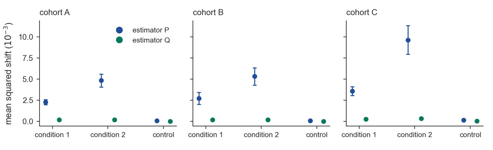

# Pattern 11 examples: per-sample evidence, synthetic data

Every script here generates its own data with a fixed seed, so nothing from an unpublished manuscript is
shown; the *forms* are the ones a corresponding author accepted after rejecting the summary-only versions
(see `docs/CASE_STUDIES_AUTHOR_REVIEW.md`). Run any of them from the repository root:

```bash
PYTHONPATH=. python examples/11a_object_paired_cloud.py
```

| Script | Figure | Form (ladder level) | The rejected counterpart it replaces |
|---|---|---|---|
| `11_before_summary_only.py` | `figures/11_before.png` | three panels of means with 95 % intervals | — this *is* the rejected form ("too crude, I could read the table") |
| `11a_object_paired_cloud.py` | `figures/11a_after.png` | (a) the object: a 64 × 6 measurement-axis matrix in three variants with axis-pair counts; (b) per-sample paired cloud on the identity line vs a matched arm on the zero line; (c) dose curve, last and smallest (1 + 2 + 5) | three point-interval panels |
| `11b_distribution_grid_exceedance.py` | `figures/11b_after.png` | 3 cohorts × 3 conditions grid of peak-normalized per-sample shift distributions, plus an exceedance column on clean data (4) | `11_before.png` |
| `11c_mechanism_cloud.py` | `figures/11c_after.png` | per-sample effect against a nameable mechanism variable, three sizes on one curve crossing zero, binned medians + IQR; compressed control strip; endpoint last (3 + 5) | four panels of mean lines |
| `11d_error_grid_ecdf.py` | `figures/11d_after.png` | 3 × 4 grid of log–log error-vs-error clouds with the share below the diagonal printed, drifting across the diagonal with budget; ECDF row (4) | a pooled-gain curve alone |




What to copy from these scripts rather than from the pictures:

- `structure_strength(...)` is called **before** the cloud is drawn; the example prints it. If it fails, the
  panel is not drawn.
- Numbers printed in the panel are computed from the same arrays that are plotted, never typed in.
- Reference lines encode the null (identity, zero, "unchanged"); there is no decorative structure.
- Control conditions get a narrow strip (`11c`, panel b) or a narrow column (`11b`, column c).
- Labels are ≤ 6 words with no verbs; explanations belong in the caption.
- Panel letters use the APS form `(a)`; switch `letter(..., style="bold")` for Nature-family journals.
